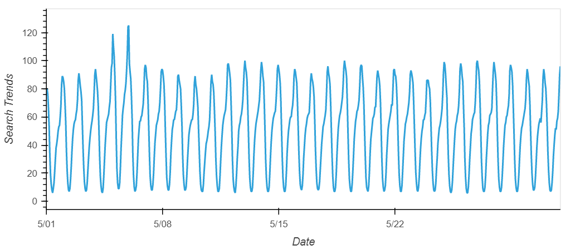
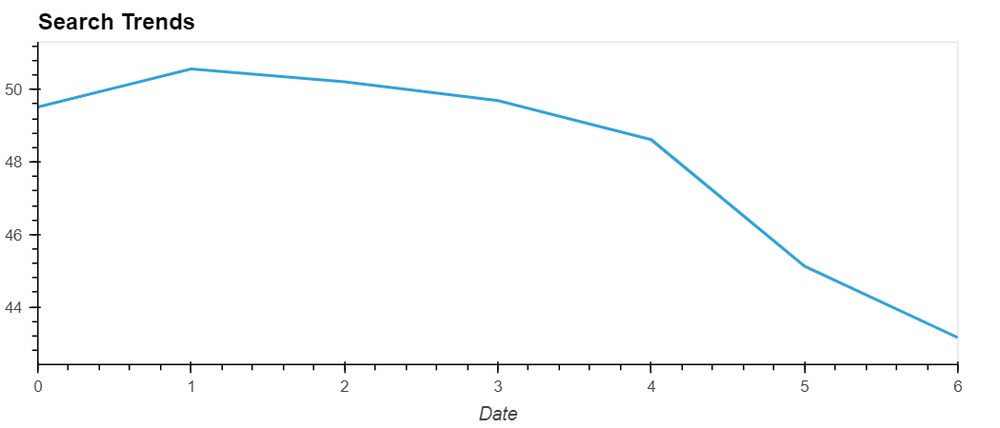
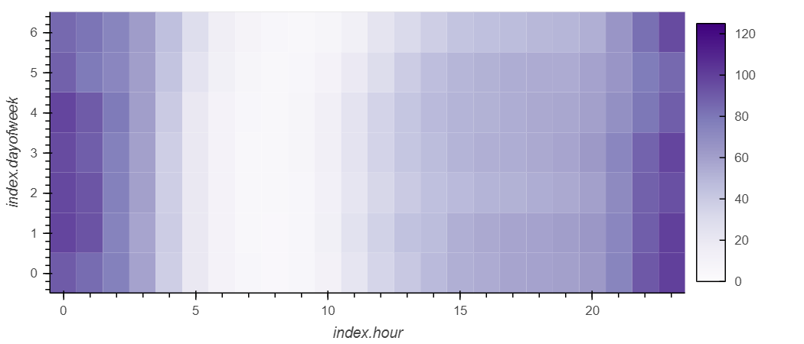
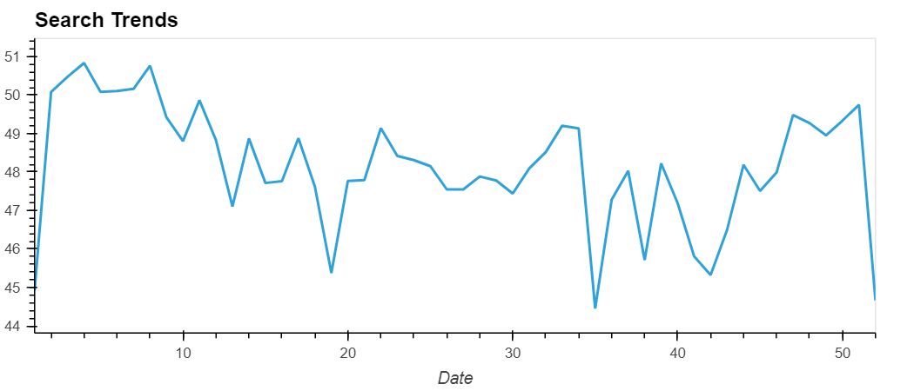
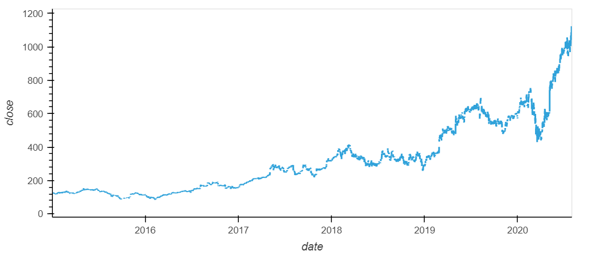
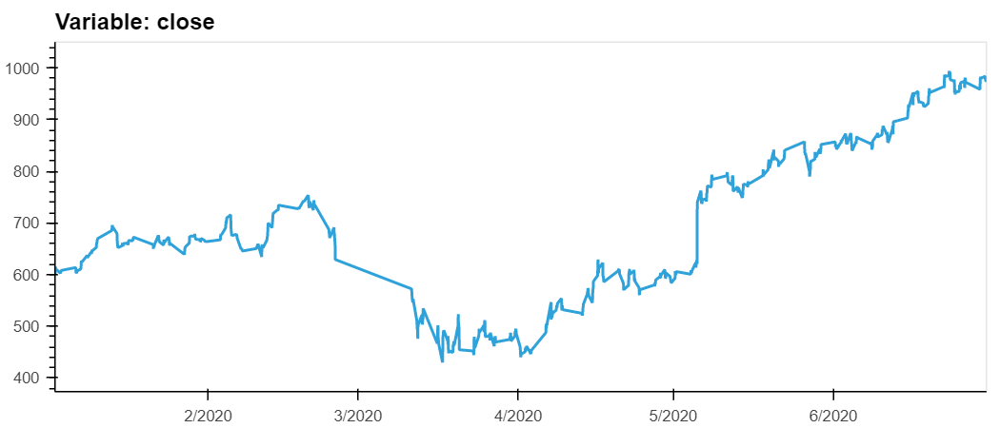
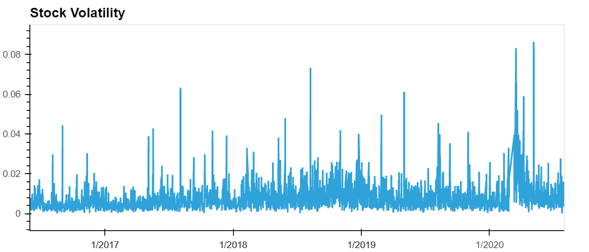
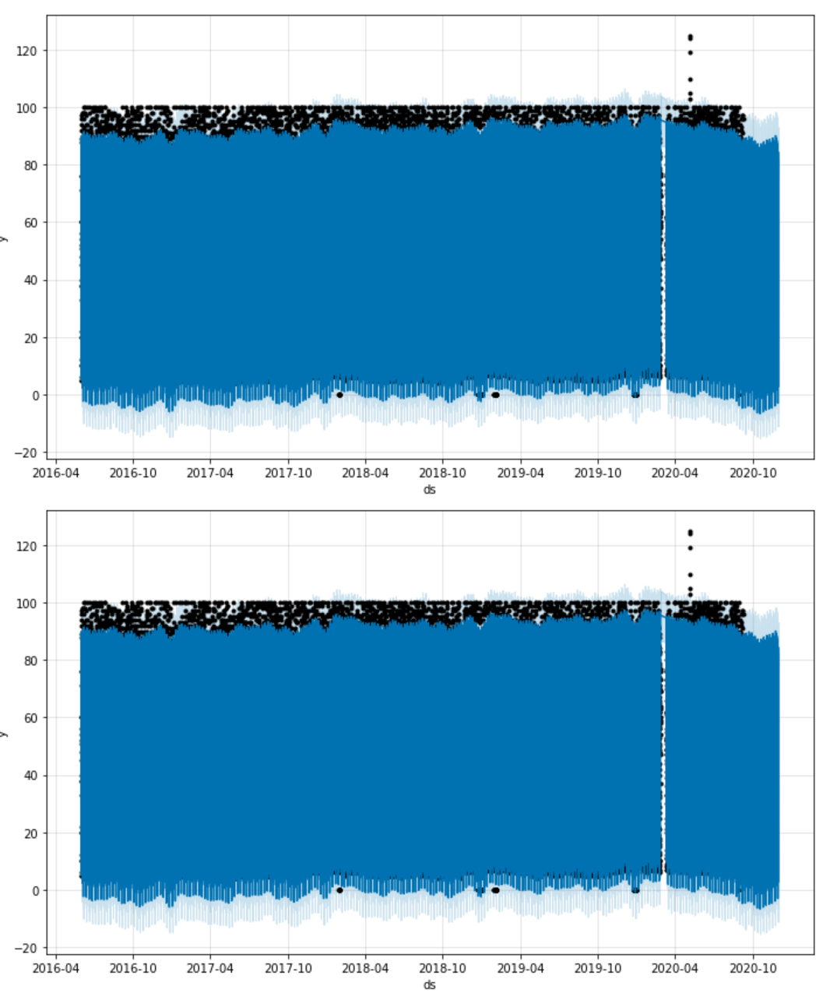
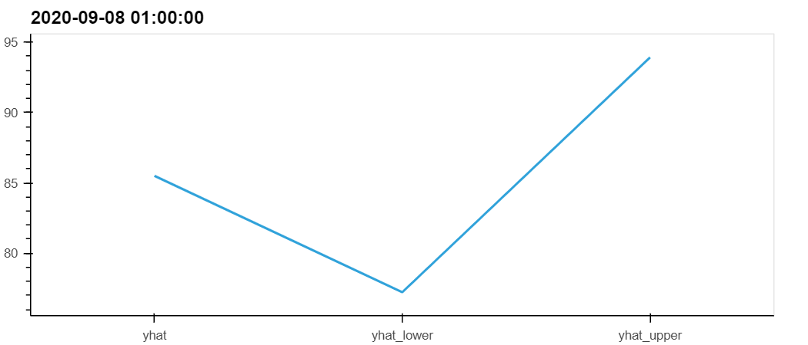
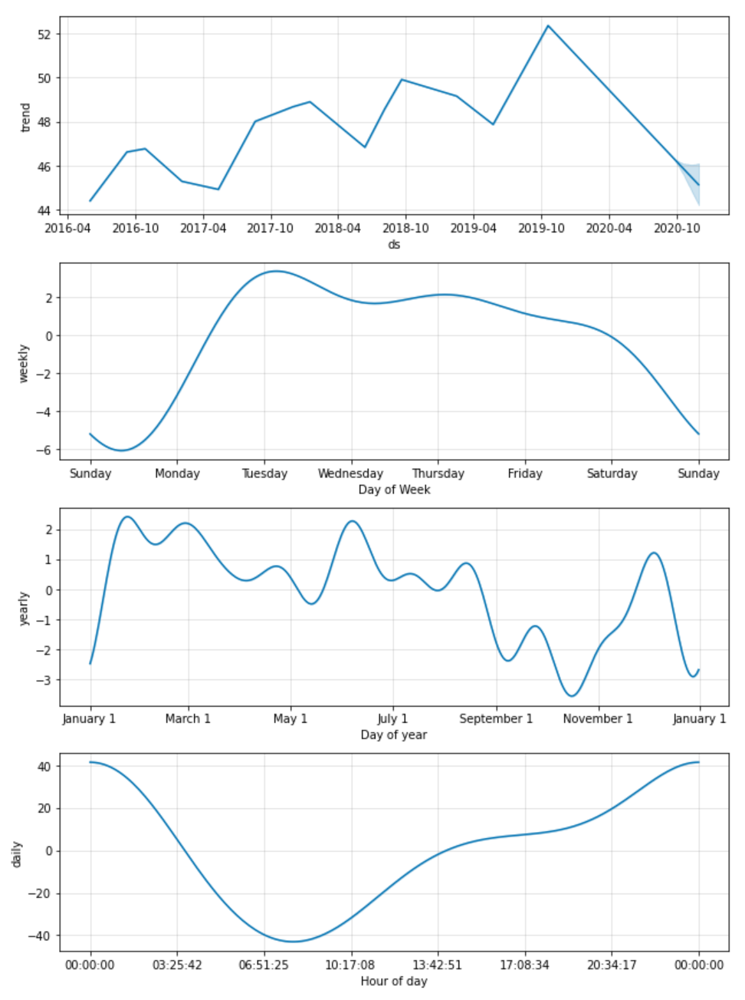

# Module 11 - Time Series

*This week we hypothesised working as a growth analyst at MercadoLibre, tasked to innovate ways to stimulate company growth through analysis of the company's user and financial data, in particular frequency of search traffic, and using this insight to profitably trade the company's stock*

The Jupyter Notebook containing all work may by found under ```code``` in a notebook file titled ```forecasting_net_prophet```

**Step 1 - Find Unusual Patterns in Hourly Google Search Traffic**

> Search trends for the month of May 2020 were analysed

* Total Search Traffic for May 2020: 38,181
* Median Monthly Traffic Accross the Data: 34,343
* Difference in Traffic in May 2020: +3,837

Visualization of Search Trends in May 2020


**Step 2 - Mine the Search Traffic Data for Seasonality**

> Search trends over the entire data set were identified with respect to the days of the week and weeks of the year

Visualization of Search Trends By Day of Week


Heatmap of Search Activity, Plotted by Hour against Day of Week


* There is a notable concentration of traffic at hours indexed 0, 1, 22 and 23. There is also a considerable decrease in traffic between hours indexed 5 through 10. Drawing from the heatmap alone, and assuming that traffic would be less between 12am - 6am as people would be asleep, we can postulate that highest activity occurs in the evening, after most people have come home from work

Visualization of Search Trends by Week of the Year


* There is a comparitive increase in the number of searches between weeks 40 and 52. However, the maxima of this group of data still appears to be below the highest search period of the year, between weeks 1 and 11. Nevertheless, the period between weeks 40 to 52 does appear to experience the greatest rate of increase in traffic

**Step 3 - Relate the Search Traffic to Stock Price Patterns**

> A potential relationship between search trend data and company stock price movement was investigated

Closing Prices of MercadoLibre Stock Price Over Time


Aligned Comparison Graphs Visualizing Closing Prices and Search Trends with Respect to Time


* Both time series graphs agree with the suposition that the market experienced an initial slowing down at the beginning of 2020 followed by increased growth, with a notable decrease in both search trends and close prices between March and April of 2020, with dramatic increases in both regards shortly after. Also to note is that judging by the graphs, it appears that increases in search trends preceeded the increase to stock price, with increases most detected in Mid-March and start of April, respectively

MercadoLibre Stock Volatility Time Series


Correlation Table Displaying Stock Volatility, Lagged Search Trends and Stock Return


* There is a very small correlation between the lagged search traffic and the stock volatility and between the lagged search traffic and the stock price returns:
    - correlation between lagged search traffic and stock volatility is roughly -0.15
    - correlation between lagged search traffic and hourly stock returrn is lower, still, at roughly 0.02

**Step 4 - Create a Time Series Model with Prophet**

> The Meta Prophet Application was Used to Forecast Patters in the Hourly Search Trends Data

Plot of the Predictions Generated by Prophet of the Search Trends Data


* Judging by the prediction produced by Prophet, it would appear that popularity is expected to decrease in the near-term, and is in fact expected to fall to a level below historical popularity

Visualization of the Prophet Features (yhat, yhat_lower and yhat_upper) Over the Past 2000 Hours


Plots of Components for Prophet Forecast of Search Trends Data


**From our analysis of Search Trends Data over time and by leveraging Meta's Machine Learning Application known as Prophet, we were able to deduce that:**

* The time of day that exhibits the greatest popularity is midnight, or 00:00:00
* The day of the week that exhibits the greatest traffic is Tuesday
* Within the calander year, lowest traffic is exhibited in late September, with the days leading up to the new year coming in at a close second