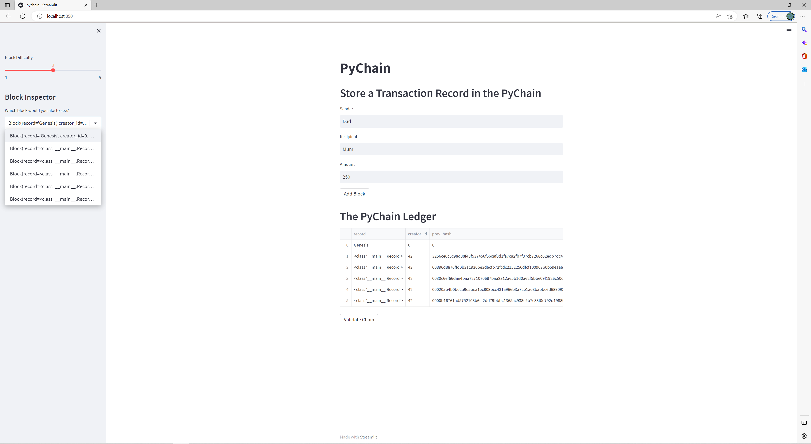
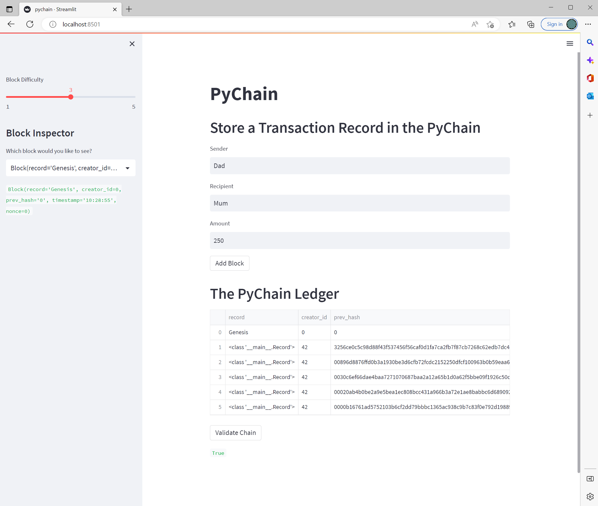

# Module 18 Challenge - Blockchain

A blockchain ledger system was developed which allows us to conduct and record transactions using a blockchain. Functionality was imbedded to record the following attributes:

* Sender
* Receiver
* Amount

We are also able validate the blockchain and check whether the tranctions are valid by confirming whether all block hash's adjoin with one another.

The application was developed using "Streamlit".

*Here is a screenshot of the application and the drop down menu of previous transactions:*

*Here is a screenshot of the application after the chain has been validated*

---

**Navpreet Nat | 30/01/2023**