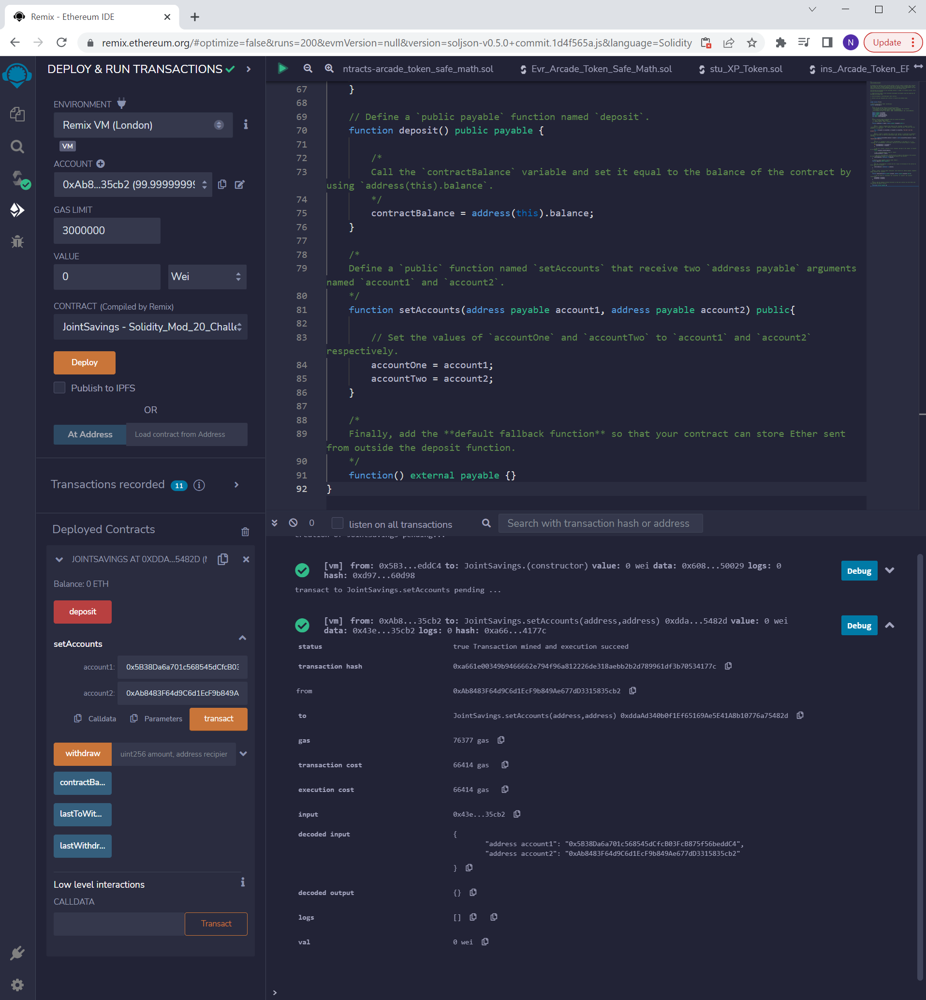
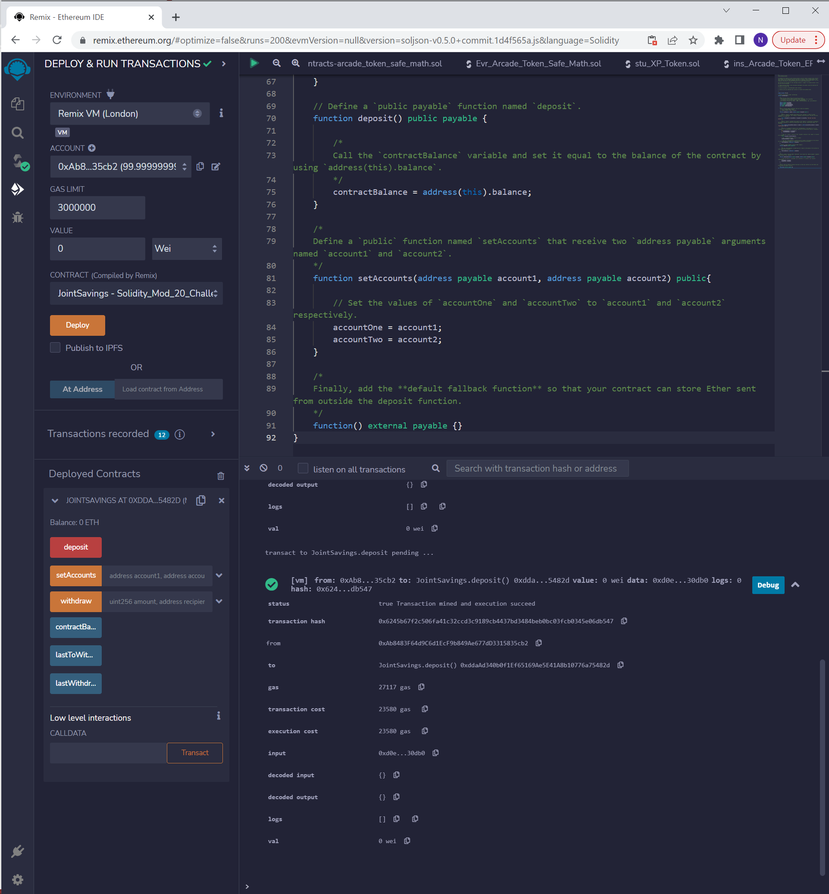
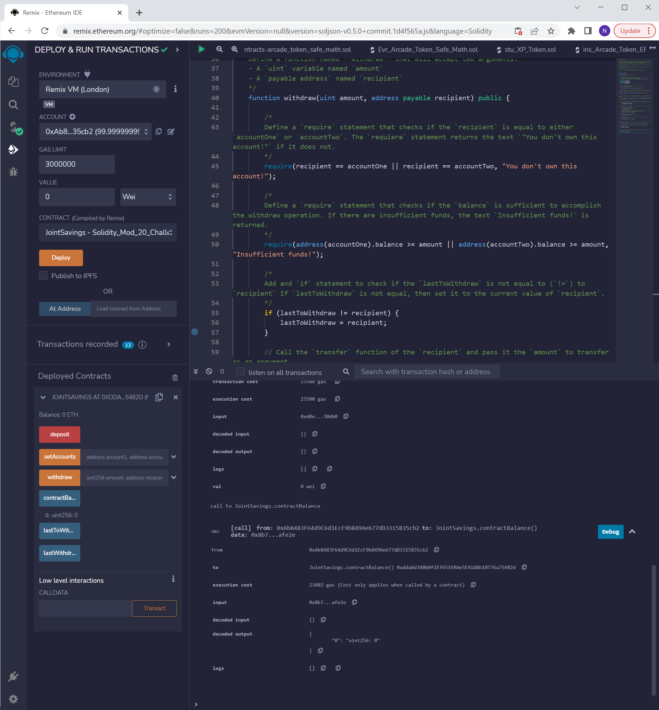
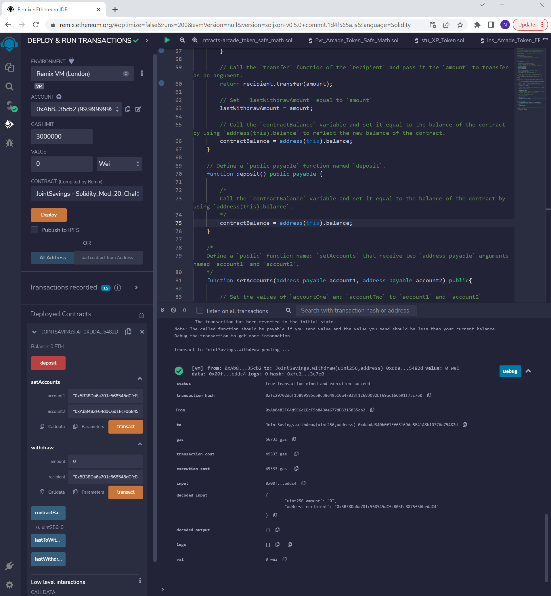
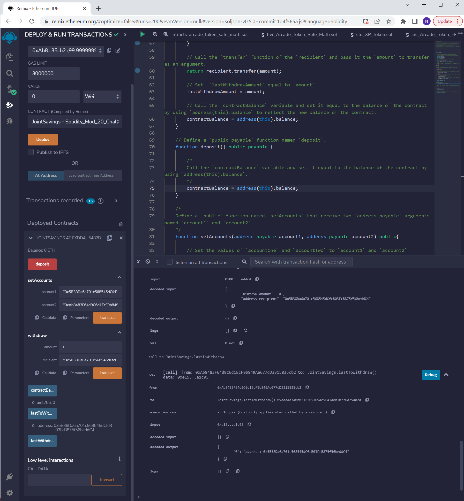
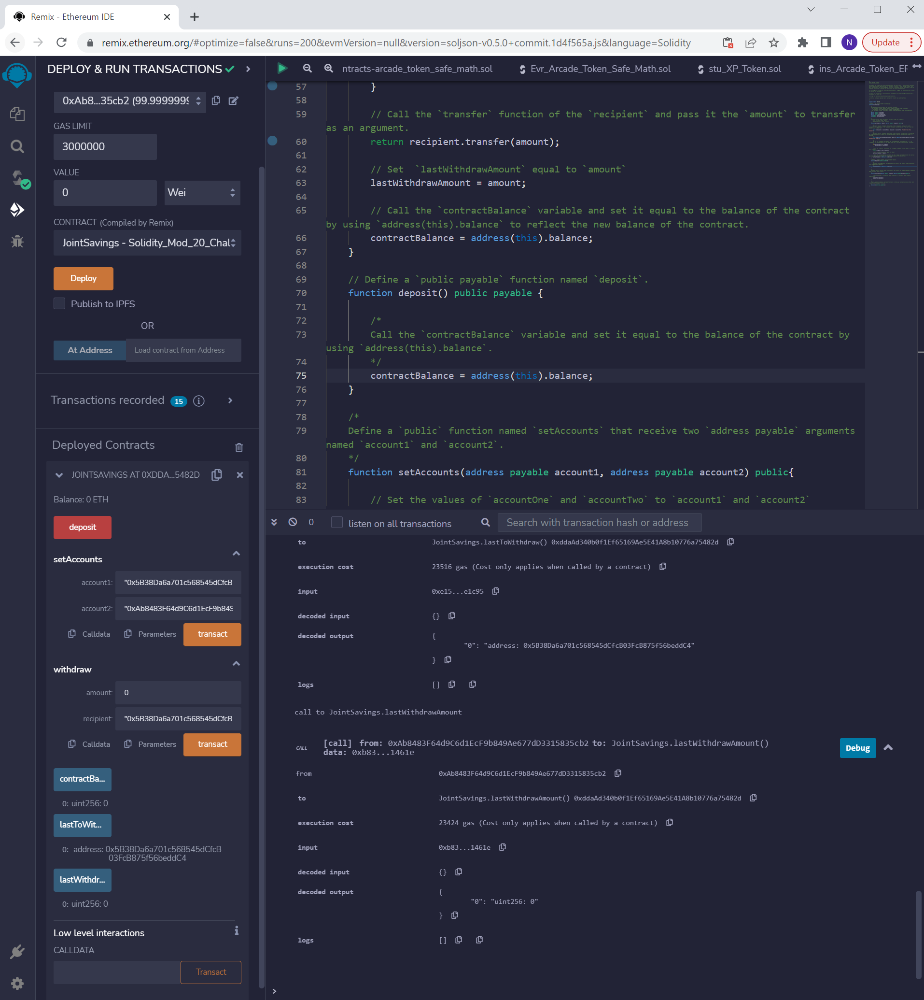

# Module 20 Challenge

*Completed work located in solidity file titled ```joint_savings.sol```*

## Demonstration of Smart-Contract Functions

**```setAccounts``` Function:**


**```deposit``` Function:**


**```contractBalance``` Function:**


**```withdraw``` Function:**


**```lastToWithdraw``` Function:**


**```lastWithdrawAmount``` Function:**


---

Navpreet Nat | 13/02/2023